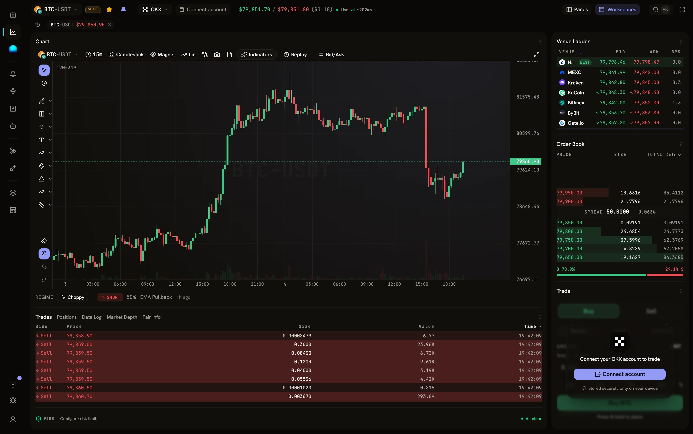
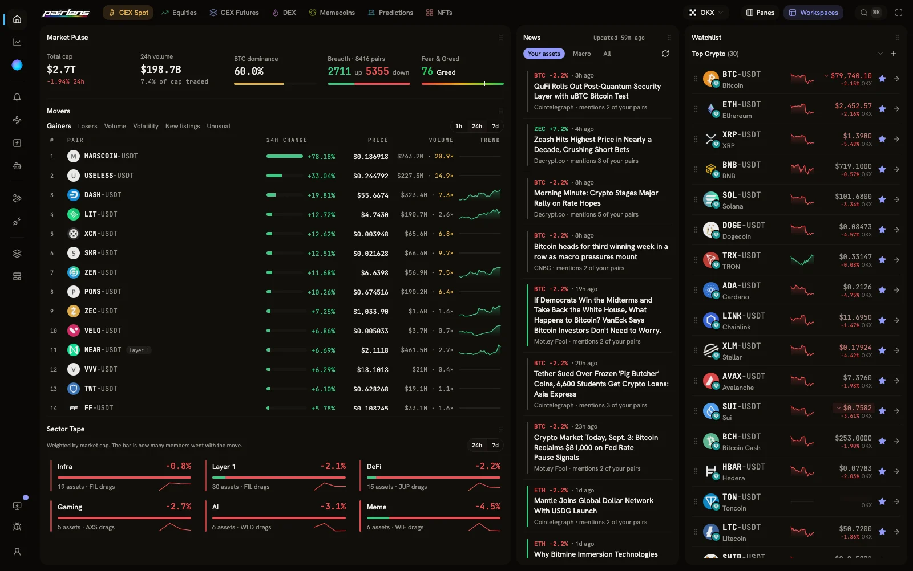
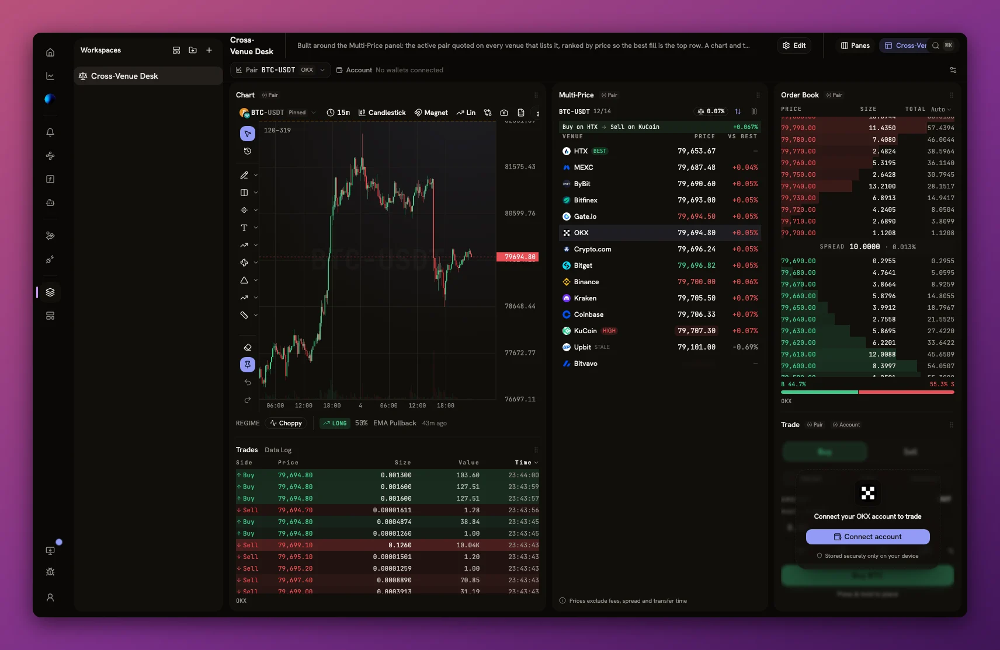
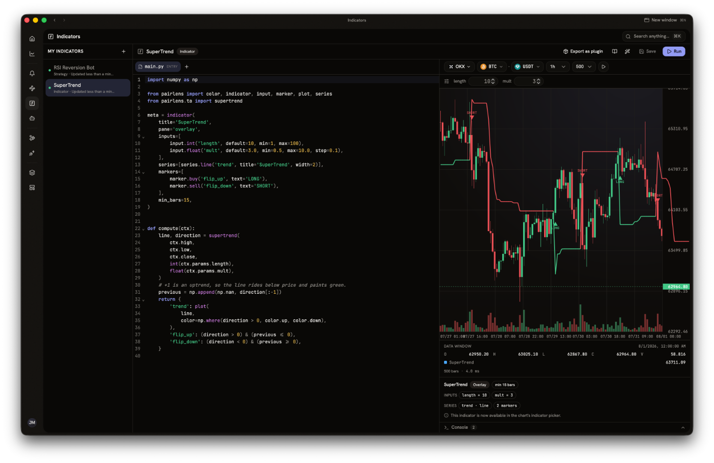
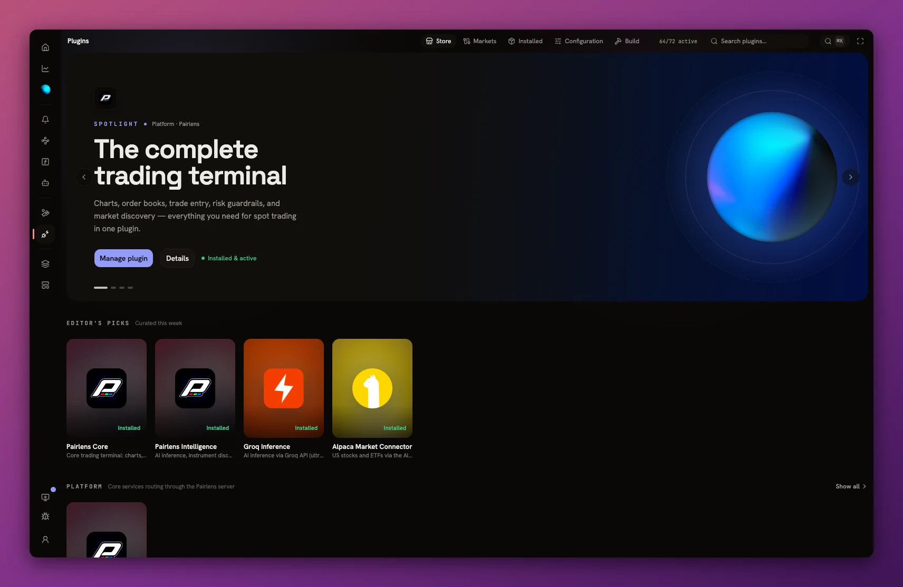

<div align="center">


# Pairlens

**The local-first AI trading terminal. Your keys. Your machine. Your rules.**

The kind of trading desk that usually costs thousands of dollars a year: free, private, and entirely yours. 14 crypto exchanges, US equities, and on-chain DEX trading in one desk, with professional charts, an AI co-pilot, and your keys on your machine.

[Website](https://pairlens.finance) · [Launch Web Terminal](https://terminal.pairlens.finance) · [Docs](https://pairlens.finance/docs) · [Download](https://github.com/Pairlens/trading-terminal/releases) · [Charts Engine](https://github.com/Pairlens/fast-financial-charts) · [X](https://x.com/pairlens)

[](https://github.com/Pairlens/trading-terminal/actions/workflows/ci.yml)
[](LICENSE.md)
[](https://pairlens.finance/install)
[](apps/desktop/)

<a href="https://terminal.pairlens.finance"></a>

</div>

## Why Pairlens

- **Every market on one desk.** Trade spot on OKX, Binance, Coinbase, Kraken, and 10 more exchanges, US equities through Alpaca, and on-chain DEXs across Solana, Ethereum, Base, Arbitrum, BNB Chain, and Polygon, side by side in the same interface.
- **Your keys never leave your machine.** Market data streams directly from exchanges to you. API keys and wallet secrets live in your OS keychain on desktop, or in an encrypted local vault in the browser. There is no server between you and your exchange, and nothing to trust but your own machine.
- **An AI co-pilot, on your terms.** It reads your charts, portfolio, and market context, runs research, and proposes trades that you explicitly confirm. It never overrides your risk guardrails, which are enforced below the AI, not by it. Bring your own AI key (Groq, OpenAI, Anthropic, OpenRouter) or subscribe to the hosted Pairlens Intelligence plan.
- **Professional charts, no paywall.** Powered by [Fast Financial Charts](https://github.com/Pairlens/fast-financial-charts), our own MIT-licensed WebGL2 engine: 90 indicators, 42 drawing tools, multi-pane layouts, and buttery live streaming. Write your own indicators in real Python, with pip packages, running locally in the terminal.
- **Automation with guardrails.** Deterministic strategy signals, price and indicator alerts, and user-defined workflows. Everything that can place an order goes through the same guarded path with your risk limits.
- **Make it yours.** Panels, workspaces, and 18 themes compose into whatever desk you want. Connectors, AI providers, data sources, and themes are plugins with a public SDK: install from the Plugin Store, build your own, or run a private registry for your team. Anything you can't change in config, you can change in code. The full source is in the open, no watermark, no "contact sales".

<table>
  <tr>
    <td width="50%"><a href="https://pairlens.finance/#features"></a><p align="center"><sub><b>Discover</b> · markets, news, Fear &amp; Greed, top coins</sub></p></td>
    <td width="50%"><a href="https://pairlens.finance/#features"></a><p align="center"><sub><b>Workspaces</b> · parameterized multi-chart layouts</sub></p></td>
  </tr>
  <tr>
    <td width="50%"><a href="https://pairlens.finance/#features"></a><p align="center"><sub><b>Python indicators</b> · real Python with pip packages, run locally</sub></p></td>
    <td width="50%"><a href="https://pairlens.finance/#features"></a><p align="center"><sub><b>Plugin Store</b> · connectors, AI providers, and themes</sub></p></td>
  </tr>
</table>

## Get started

Three ways in, no account required for any of them:

- **In your browser, right now.** [terminal.pairlens.finance](https://terminal.pairlens.finance) runs the full terminal with nothing to install. On a phone, the same URL becomes a chart-centric mobile trading terminal. Five venues (Coinbase, Gate, KuCoin, MEXC, Bitfinex) don't serve browsers and need the desktop app; the other ten plus DEXs work everywhere.
- **On your desktop.** The Tauri app for macOS, Windows, and Linux is the primary distribution: OS-keychain credential storage, background bots, and automatic updates. Builds are published on the [Releases page](https://github.com/Pairlens/trading-terminal/releases) as they ship.
- **From source, in about two minutes.** The only requirement is [Bun](https://bun.sh) ≥ 1.3 (plus the Rust toolchain for the desktop shell):

```bash
git clone https://github.com/Pairlens/trading-terminal.git
cd trading-terminal
bun install
bun run dev
```

That's it. No Docker, no `.env.local`. Open `http://localhost:3000`: market data streams directly from exchanges, everything persists locally, and optional cloud conveniences (sign-in, news, top coins, symbol logos) are served by the hosted Pairlens Cloud API, so a fresh checkout behaves exactly like the shipped app.

Prefer fully offline? `PAIRLENS_STANDALONE=1 bun run dev` turns off every cloud feature. The terminal is built to work without any Pairlens server.

## Explore the project

| Part                                                                       | What it is                                                                               |
| -------------------------------------------------------------------------- | ---------------------------------------------------------------------------------------- |
| [Terminal](apps/terminal/)                                                 | The trading terminal: TanStack Start SPA (React 19), modular panes, workspaces           |
| [Mobile terminal](apps/terminal/src/mobile/)                               | The phone shell: same codebase, same guarded order path, five-tab chart-first UI         |
| [Fast Financial Charts](https://github.com/Pairlens/fast-financial-charts) | WebGL2 charting engine built from scratch for financial data. Free, MIT, standalone repo |
| [Plugin SDK](packages/plugin-sdk/README.md)                                | Build connectors, themes, and AI providers; scaffold with `bun run create:plugin`        |
| [Plugin Registry](apps/registry/README.md)                                 | Self-hostable plugin distribution. Run a private registry for your company               |
| [CLI](apps/cli/README.md)                                                  | Headless market access from your shell: candles, tickers, signals, paper orders          |
| [Desktop app](apps/desktop/)                                               | Tauri 2 shell with OS-keychain credential storage and strict network sandboxing          |
| [Contributing](CONTRIBUTING.md) · [Security](SECURITY.md)                  | Dev setup, pre-PR checklist, and how to report vulnerabilities                           |

## Connectors

Bundled on a fresh install. All 14 crypto exchanges support both market data and trading:

| Type               | Connectors                                                                                                   |
| ------------------ | ------------------------------------------------------------------------------------------------------------ |
| Crypto exchanges   | OKX, Binance, ByBit, Coinbase, Kraken, KuCoin, Gate, Bitget, MEXC, HTX, Crypto.com, Bitfinex, Upbit, Bitvavo |
| US equities broker | Alpaca                                                                                                       |
| DEX trading        | Jupiter (Solana), EVM DEX connector (Ethereum, Base, Arbitrum, BSC, Polygon)                                 |
| DEX market data    | GeckoTerminal, DexPaprika                                                                                    |
| AI inference       | Groq, OpenAI, Anthropic, OpenRouter (bring your own key)                                                     |
| AI web search      | Tavily, Exa (bring your own key)                                                                             |
| Themes             | 18 bundled theme plugins                                                                                     |

Anyone can build a connector by implementing `MarketAdapter` and publishing it to the plugin registry. See `packages/plugin-sdk/` and `bun run create:plugin`.

## Architecture

```
DESKTOP APP (Tauri)
  Terminal SPA (webview)          ──direct WS/REST──►  Exchanges / DEXs / Brokers
  Market connector plugins
  Strategy engine (TS)
  Credentials in OS keychain

ALSO
  Web terminal (terminal.pairlens.finance)   Mobile terminal (same URL, < 768px)
  CLI (headless market interaction)          Plugin registry (self-hostable)
```

- **Terminal** (`apps/terminal/`): TanStack Start SPA (React 19). Market data streams directly from exchanges via market connector plugins; there is no intermediate market-data server. One codebase serves the desktop pane grid, the hosted web terminal, and the mobile shell.
- **Market connector plugins** (`packages/plugins/`): each connector implements the `MarketAdapter` interface and owns its exchange WebSocket/REST connections, candle buffers, and order routing.
- **Strategy engine** (`packages/strategy-engine/`): pure TypeScript signal math (EMA, ATR, breakout, pullback, mean reversion, regime detection), computed on demand by the terminal and CLI. No I/O.
- **AI co-pilot**: the agentic loop runs entirely client-side in the terminal (~60 tools: chart control, market/portfolio reads, workspace actions, confirm-gated trading). Inference goes through bring-your-own-key provider plugins.
- **Charts**: [Fast Financial Charts](https://github.com/Pairlens/fast-financial-charts), a standalone MIT-licensed WebGL2 charting engine (own repo), consumed by the terminal as the `@pairlens/fast-financial-charts` dependency. React bindings ship under `@pairlens/fast-financial-charts/react`.
- **CLI** (`apps/cli/`): headless access to the same connectors and strategy engine.
- **Plugin registry** (`apps/registry/`): distribution point for third-party plugins built with `packages/plugin-sdk/`.

Everything above runs without any Pairlens server. Optional cloud conveniences (sign-in, cross-device sync) are covered in [What's not in this repo](#whats-not-in-this-repo-yet).

## Development

| Command                    | What it does                                     |
| -------------------------- | ------------------------------------------------ |
| `bun run dev`              | Terminal (Vite dev server)                       |
| `bun run dev:desktop`      | Tauri desktop app (requires Rust toolchain)      |
| `bun run dev:terminal`     | Terminal only                                    |
| `bun run dev:registry`     | Plugin registry only                             |
| `bun run build`            | Build all workspaces (Turborepo)                 |
| `bun run typecheck`        | TypeScript strict check across all workspaces    |
| `bun run lint`             | ESLint across all workspaces                     |
| `bun run test`             | All TypeScript tests                             |
| `bun run test:conformance` | Cross-connector market-data/order contract suite |
| `bun run conformance`      | Same suite, live per-connector grid              |
| `bun run format`           | Prettier format                                  |
| `bun run create:plugin`    | Scaffold a new plugin                            |

Run a single package's tests with `bun test packages/<name>`. Every git worktree gets its own derived dev ports, so multiple checkouts can run `bun run dev` in parallel.

### CLI

```bash
bun apps/cli/src/index.ts candles --pair BTC-USDT --timeframe 1h --limit 100
bun apps/cli/src/index.ts ticker --pair BTC-USDT --watch
bun apps/cli/src/index.ts signals --pair BTC-USDT --timeframe 4h
bun apps/cli/src/index.ts markets
```

See the [CLI README](apps/cli/README.md) for all commands and flags.

### Monorepo layout

Turborepo + Bun workspaces.

```
apps/
  terminal/                TanStack Start SPA (React 19)
  desktop/                 Tauri 2 desktop app, the primary distribution
  registry/                Plugin registry server (self-hostable)
  marketing/               Astro static site
  cli/                     Headless CLI
packages/
  plugins/                 Bundled plugins (connectors, inference, core, themes)
  plugin-system/           Plugin manager + capability resolver
  plugin-sdk/              SDK for third-party plugin authors
  create-pairlens-plugin/  Plugin scaffolding CLI
  market-engine/           MarketAdapter interface, CandleBuffer, WS utilities
  strategy-engine/         Deterministic signal engine
  workflow-engine/         User-defined automation workflows
  notification-engine/     Notification rules and delivery
  persistence/             Local/remote persistence adapters
  shared/                  Shared types (client/server API contract)
  ui/                      ShadCN + Tailwind v4 component library
examples/                  Example third-party plugins
```

## What's not in this repo (yet)

One piece of Pairlens is not in this repo: the **App Server**, a small backend that provides optional conveniences like sign-in, cross-device settings sync, market news, and a hosted AI proxy for users who don't bring their own key. **It is not needed to run Pairlens.** Everything in this repo works fully standalone with local persistence, and we plan to publish the App Server's source in the future.

For development you don't need it either: `bun run dev` targets the hosted instance at `api.pairlens.finance` by default (falling back gracefully), auto-detects a locally-running App Server on `:4046`, and honors an explicit `VITE_APP_SERVER_URL`. `PAIRLENS_STANDALONE=1` opts out entirely.

## Contributing

See [CONTRIBUTING.md](CONTRIBUTING.md) for dev setup, the pre-PR checklist, and how licensing and the CLA work for contributions, and [SECURITY.md](SECURITY.md) for how to report vulnerabilities. Detailed architecture notes live in [CLAUDE.md](CLAUDE.md).

## License

Pairlens is source-available under the [Functional Source License](LICENSE.md) (FSL-1.1-Apache-2.0). In practice:

- **Free for you.** Use it, read it, modify it, and self-host it for yourself, your team, or your company, at no cost. The only thing you can't do is sell a competing commercial product or service built from it.
- **It becomes open source on a timer.** Each release converts to [Apache 2.0](https://www.apache.org/licenses/LICENSE-2.0) two years after it ships. Whatever happens to us, the terminal you use stays free and forkable.
- **Charts are MIT.** The [Fast Financial Charts](https://github.com/Pairlens/fast-financial-charts) engine lives in its own repo under plain MIT, commercial use included.

Why not plain MIT for everything? Because the point of Pairlens is to stay a free, transparent alternative to the big trading platforms, and the FSL stops one of them from taking the code and selling it back as a closed product. The reasoning is spelled out in [CONTRIBUTING.md](CONTRIBUTING.md) and on [pairlens.finance](https://pairlens.finance/licensing).

## Star history

If Pairlens is useful to you, a star helps other traders find it.

[](https://star-history.com/#Pairlens/trading-terminal&Date)
