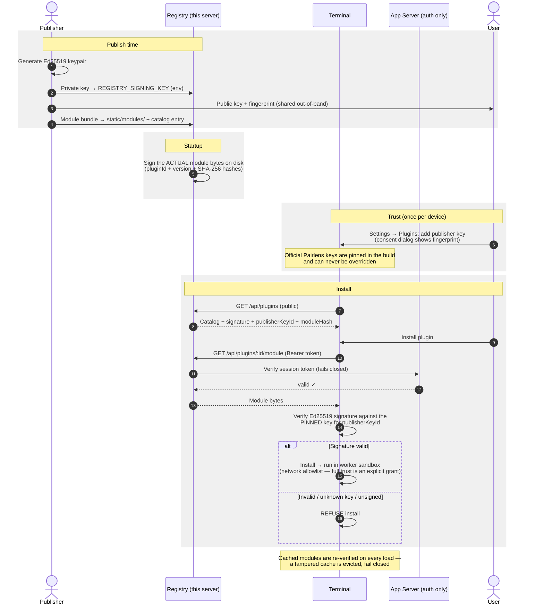

# Pairlens Plugin Registry

A small, read-only HTTP server that distributes Pairlens plugins. This is the same code that runs the official registry at `https://registry.pairlens.finance` — and you are welcome to run your own.

## Design: the registry is not trusted

The security model deliberately places **zero trust in the registry itself**:

- **Terminals only install signed plugins.** Every downloadable module carries a detached Ed25519 signature, and the terminal verifies it against publisher public keys **pinned in the app** (`packages/shared/src/publisher-keys.ts`). A compromised — or malicious — registry cannot mint a key the terminal trusts.
- **Read-only by design.** There is no publish/upload endpoint and no database. The catalog is compiled into the binary from `src/catalog.ts`; module files are static assets signed at startup from the actual bytes served, so the catalog can never drift from what's on disk.
- **Community plugins are source-in-repo.** Third parties publish by PR-ing source into `community/` (see [community/README.md](./community/README.md)). At startup the registry validates, **builds the source itself**, and signs the result with a separate community key — terminals pin that key as a distinct tier and run anything it signs permanently sandboxed (no full-trust grant, no trading capabilities).
- **Auth fails closed.** Download endpoints require a Bearer token: either a static service token (`REGISTRY_API_TOKENS`, constant-time compared) or a live user session verified against the App Server. Any error, timeout, or missing config denies access.
- **Sandboxed at install.** Independently of the registry, non-bootstrap plugins run in a worker sandbox with a network allowlist; full trust is an explicit user grant.

The committed key in `keys/dev-publisher.key` is the **development** publisher key. It is intentionally public: it lets any local registry sign its catalog during development. Production terminal builds never trust it (`import.meta.env.DEV` gate) — production publishers are pinned via `OFFICIAL_PUBLISHER_KEYS`.

## How the whole process works



The load-bearing property: **the registry never decides what is trusted**. It only stores and serves bytes plus a signature it cannot forge for any key the terminal actually pins. Compromising the registry lets an attacker serve garbage — which terminals refuse — not malicious code that installs.

## API

| Endpoint                        | Auth | Description                                    |
| ------------------------------- | ---- | ---------------------------------------------- |
| `GET /health`                   | none | Liveness (binds before any startup work)       |
| `GET /api/plugins`              | none | Catalog listing (`?category=<slug>`)           |
| `GET /api/plugins/featured`     | none | Featured entries                               |
| `GET /api/plugins/:id`          | none | Plugin detail (with signature fields)          |
| `GET /api/plugins/:id/versions` | none | Version history                                |
| `GET /api/categories`           | none | Category metadata                              |
| `GET /api/entitlement-tiers`    | none | Entitlement tiers                              |
| `GET /api/plugins/:id/module`   | yes  | Download the plugin module (302 or local file) |
| `GET /static/modules/:file.js`  | yes  | Locally-served module artifacts                |

## Running your own registry

Self-hosting is supported and encouraged — for a company distributing internal plugins, a community mirror, or local development.

### 1. Run the server

```bash
bun run dev:registry          # from the repo root (worktree-derived port, default 3005)
# or standalone:
bun apps/registry/src/index.ts
```

There is no build step — the registry runs straight from TypeScript source on [Bun](https://bun.sh) ≥ 1.3. In production:

```bash
git clone https://github.com/Pairlens/trading-terminal.git && cd pairlens
bun install --ignore-scripts          # skips dev-only postinstall helpers
PORT=3005 REGISTRY_SIGNING_KEY=... bun apps/registry/src/index.ts
```

Any Bun-capable host works (the official instance runs on Railway); put it behind your TLS proxy of choice. `/health` binds before any startup work and stays unauthenticated — point your load-balancer checks at it. Signing happens in the background after boot; entries are served unsigned (and refused by terminals) only until it completes.

### 2. Generate your publisher keypair

```bash
bun -e "
import { generatePublisherKeypair } from './packages/shared/src/plugin-signing.ts'
const kp = await generatePublisherKeypair()
console.log('public (pin this in terminals):', kp.publicKeyB64)
console.log('private (REGISTRY_SIGNING_KEY): ', kp.privateKeyPkcs8B64)
"
```

Set `REGISTRY_SIGNING_KEY` and a stable `REGISTRY_SIGNING_KEY_ID` (e.g. `acme-plugins-2026`) in the registry's environment. Keep the private key out of git. At startup the registry signs every locally-served module with it.

### 3. Add your plugins

Edit `src/catalog.ts` (entries reference manifests plus an optional `moduleUrl`) and drop module bundles into `static/modules/`. Modules are signed from the actual bytes on disk, so the catalog can never advertise a hash it doesn't serve.

### 4. Point terminals at it

- **Registry URL** is a runtime setting: **Settings → Plugins → Plugin registry** lets each user switch from the official registry to a custom URL (with an explicit acknowledgment). `VITE_REGISTRY_URL` sets the default at build time.
- **Publisher key trust** is granted per device. Users add your public key at runtime under **Settings → Plugins → Trusted publisher keys** — the flow shows the key's fingerprint and a consent warning, so share the fingerprint out-of-band. Built-in Pairlens keys can never be overridden, and runtime keys are deliberately local-only (they never sync with the user's account). For fleet deployments you can instead bake the key into your own terminal build with `VITE_EXTRA_PUBLISHER_KEYS="acme-plugins-2026:<base64 public key>"`.
- **Desktop egress**: the desktop app enforces a CSP `connect-src` allowlist (localhost and `*.pairlens.finance` are included, so local registries work out of the box). For a remote custom registry, the settings UI offers a one-click network-access grant for its host (persisted, applied after reload). Baking the host into `apps/desktop/src-tauri/src/csp.rs` remains an option for custom desktop distributions. Browser/dev builds have no such restriction.

The auth column below is only meaningful if you also run an App Server for session verification; for a fully open self-hosted registry you can instead issue static `REGISTRY_API_TOKENS` to your users or front the gated routes with your own auth proxy.

### Environment variables

| Variable                            | Purpose                                                                                                                                       |
| ----------------------------------- | --------------------------------------------------------------------------------------------------------------------------------------------- |
| `PORT` / `REGISTRY_PORT`            | HTTP port (default 3005)                                                                                                                      |
| `REGISTRY_SIGNING_KEY`              | base64 PKCS#8 Ed25519 private key used to sign locally-served modules                                                                         |
| `REGISTRY_SIGNING_KEY_FILE`         | Path to a file containing the above (falls back to the committed dev key)                                                                     |
| `REGISTRY_SIGNING_KEY_ID`           | Key id served as `publisherKeyId` (must match a key pinned in the terminal)                                                                   |
| `REGISTRY_COMMUNITY_SIGNING_KEY`    | Private key for community-tier entries (same format; falls back via `REGISTRY_COMMUNITY_SIGNING_KEY_FILE` to the committed dev community key) |
| `REGISTRY_COMMUNITY_SIGNING_KEY_ID` | Key id for community signatures (production: `pairlens-community-2026`)                                                                       |
| `APP_SERVER_URL`                    | App Server used to verify user session tokens for downloads (default `http://localhost:4046`)                                                 |
| `REGISTRY_SHARED_SECRET`            | Shared secret sent to the App Server's internal verify endpoint (set it on both services)                                                     |
| `REGISTRY_API_TOKENS`               | Comma-separated static Bearer tokens for CI / service accounts                                                                                |

Without a signing key, locally-served plugins are served **unsigned** and terminals will refuse to install them — the failure mode is always "no install", never "unsigned install".
